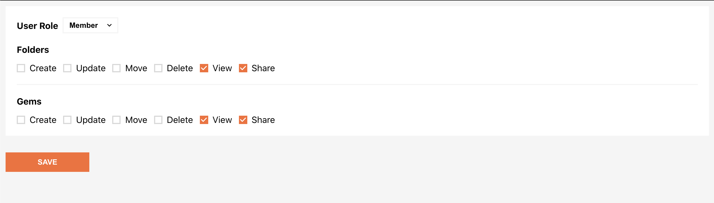
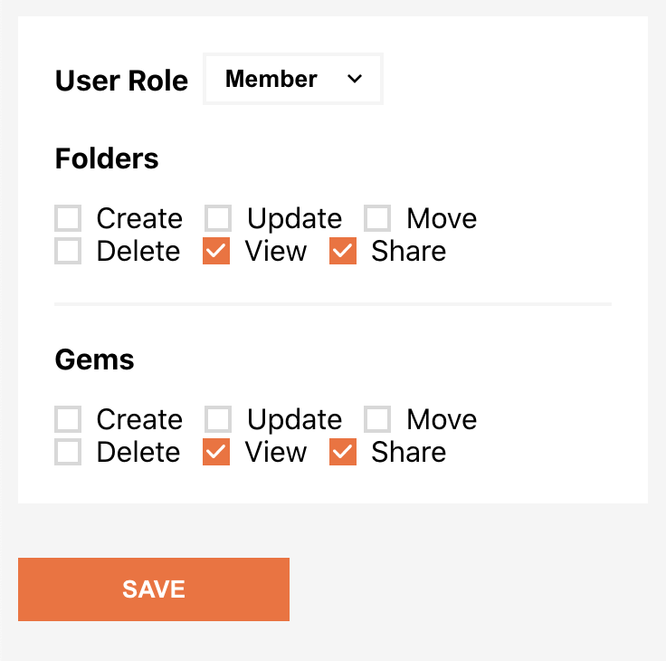

[DEMO LINK](https://irenhh.github.io/frontend-component-task/)

This project was made as a part of a JavaScript Test Assignment.  
It shows a form where you can choose a role and get a corresponding set of permissions. After submitting the form you can see what permissions and role you have.

**The project was implemented using the following stack:**

- React
- TypeScript
- styled components

**You can clone the repository and run the project on your machine.**  

- run `npm i` to install dependencies.  
- run `npm start` to view the app in the development mode.  
- open _http://localhost:3000_ to view it in the browser.

**Screenshots:**

  

